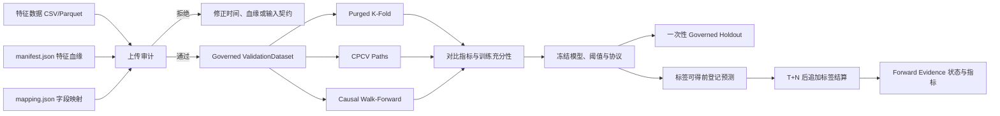

# skill-ml-purged-cv：金融时序防泄漏交叉验证

> 根目录 `SKILL.md` 是用户和消费端 Agent 的统一入口；`AGENTS.md` 仅用于开发、测试和发布本仓库，不参与 Skill 触发或运行。

`skill-ml-purged-cv` 是面向金融机器学习训练、模型选择和稳健性评估的防泄漏验证工具。项目提供 Purged K-Fold、Embargo、Combinatorial Purged Cross-Validation（CPCV）、Causal Walk-Forward、特征可用性与血缘治理、策略选择过拟合审计、一次性最终 Holdout，以及“预测先登记、标签后结算”的 Temporal Forward Evidence。

它解决的核心问题不是“替用户找到一个赚钱模型”，而是回答一个更基础、也更容易被忽略的问题：**当前模型分数是否因为未来信息、标签区间重叠、全局预处理或错误的验证切分而虚高。**

项目既可以作为 Python 库使用，也提供面向普通用户和 Agent 的命令行入口。当前版本为 `0.9.0`，支持 Python 3.11 及以上版本，并在 Windows、Linux、macOS 上使用同一套核心逻辑。

## 一分钟快速开始

安装包含 CSV/Parquet 上传能力的完整版本：

```powershell
python -m pip install "purged-kfold-validation[upload] @ git+https://github.com/quantskills/skill-ml-purged-cv.git@main"
```

执行一条命令验证安装、内置示例和标准 JSON 输出是否正常：

```powershell
purged-cv-skill demo
```

成功时会得到一个版本化 JSON 回执，基本结构如下：

```json
{
  "schema_version": "1",
  "status": "success",
  "action": "audit",
  "request_digest": "<sha256>",
  "engine": {
    "name": "purged-kfold-validation",
    "version": "0.9.0"
  },
  "authoritative_cli_result": {
    "status": "success",
    "stage": "audit"
  },
  "warnings": [
    "Structural leakage controls and model metrics are not profitability claims."
  ],
  "errors": []
}
```

这一步只验证安装和治理链路，并不代表模型有效或策略可以交易。

Agent 可以通过 `$skill-ml-purged-cv` 触发根 `SKILL.md` 中的执行流程。Skill 只负责选择正确入口、保持证据边界和解释结果；Purge、CPCV、训练和结算逻辑始终由同一个已安装 Python 包执行，因此不同 Agent 不需要各自复制算法。

## 为什么常规 K-Fold 不适合金融时序

普通 K-Fold 默认样本相互独立，并允许随机打乱。但金融样本通常具有以下结构：

- 一个标签可能依赖未来数日或数周，例如 `T+5` 收益；
- 相邻样本的标签区间大量重叠；
- 同一交易日可能包含多个资产，不能把同日样本拆到训练集和测试集两侧；
- 滚动均值、波动率、标准化、PCA、特征筛选等操作可能使用测试期状态；
- 数据可能经历复权、换月、修订或延迟发布；
- 最终 Holdout 可能在反复调参中被间接使用。

如果直接随机 K-Fold，训练集可能包含确定测试标签所需的未来信息。模型即使没有显式读取未来列，也会通过样本重叠或全局预处理发生信息泄漏。

本项目把每条样本表示为一个明确的 **Information Interval（信息区间）**：

```text
[该样本最早使用的信息时间, 确定该样本标签所需的最后时间]
```

只有训练样本的信息区间与测试样本的信息区间不重叠，才能保留在对应训练折中。

## 核心逻辑

### 1. Purge：删除真正发生重叠的训练样本

Purge 不是简单删除测试集前后固定数量的行。项目会比较训练样本和测试样本的完整信息区间，并删除所有发生包含边界重叠的训练样本。

如果标签为 `T+5` 收益，信息区间通常至少延伸到未来第五个交易 Session；但最终是否删除一条样本，仍由真实区间重叠决定，而不是由“固定删五行”替代。

### 2. Embargo：测试块后的额外隔离区

在 Purge 完成后，Embargo 会继续排除每个连续测试块之后若干个 Trading Session 的训练样本，用于隔离滚动特征状态、市场冲击或其他无法完全由标签区间表达的尾部依赖。

Embargo 与 Purge 作用不同：

- Purge 处理明确的信息区间重叠；
- Embargo 处理测试块之后声明的额外隔离距离；
- Walk-Forward 的 Pre-Test Gap 位于测试块之前，也不是 Embargo。

### 3. Panel Session Group：同日多资产不可拆分

对于多资产面板数据，同一个 Trading Session 的所有资产样本必须整体进入训练侧或测试侧。项目按 Session 分组，而不是按 DataFrame 行号切分，从而避免同日市场状态跨侧泄漏。

### 4. Fold-Local：每一折重新拟合预处理和模型

任何会学习数据状态的操作都必须在每一折的训练集内重新拟合，包括：

- 缺失值填充；
- 标准化和归一化；
- PCA 或其他降维；
- 特征筛选；
- 目标编码；
- 模型与超参数搜索过程。

项目要求传入工厂函数，每一折创建全新的 transformer 和 estimator，拒绝复用已经拟合的对象。

### 5. Point-in-Time 与特征血缘

对用户上传的任意特征，系统不仅检查数值，还要求声明：

- 特征来源数据集和源字段；
- 数据版本、source digest 和 code digest；
- 转换名称、版本和参数；
- lookback 长度；
- 每个特征值实际可用的时间；
- 是否使用目标变量；
- 是否属于预计算无状态特征或必须 Fold-Local 拟合的状态操作。

缺失这些信息时系统会 fail closed，而不是猜测列名、时间含义或特征公式。

### 6. CPCV：组合多个测试组并重建完整路径

CPCV 先把按时间排序的 Session 划分成 `N` 个连续组，再从中选择 `k` 个测试组，因此会产生 `C(N, k)` 个测试组合。每个组合仍执行完整 Information Interval Purge 和 Embargo；之后把“组合 × 测试组”的样本外预测确定性地分配到多条完整 CPCV Path，使每条路径覆盖所有时间组一次。

用户不应只看所有组合的平均分。应同时查看每条 Path 的指标、中位数、P10、最差值、IQR，以及不同模型在路径间的排名稳定性。CPCV 使用测试期前后的训练数据，因此适合模型选择和历史稳健性，不替代严格因果的 Walk-Forward。

### 7. Causal Walk-Forward：每次只向前使用过去

Walk-Forward 在每个测试块之前建立训练窗口，并要求所有训练 Information Interval 严格早于测试信息。项目把测试块之前的 `Pre-Test Gap` 与测试块之后的 Embargo 分开建模；训练不足、边界交叠或测试覆盖不完整时直接拒绝，不跳过失败窗口。

它最接近真实持续训练顺序，但仍然是在已经看过的历史数据上回放，所以不能冒充一次性 Holdout 或预测先登记的 Forward Evidence。

### 8. Holdout 与 Forward Evidence：两种不同的最终证据

Governed Holdout 在设计冻结前保持未触碰，并只允许一次评估尝试；失败尝试也会消耗该数据身份。Temporal Forward Evidence 则从冻结后的未来 Session 开始，每条预测必须先于标签可得时间形成收据，之后才能结算。前者保护一段未见历史数据，后者保护真实发生顺序。

## 五类互补证据

| 方法 | 是否使用已知历史数据 | 主要用途 | 不能证明什么 |
|---|---:|---|---|
| Purged K-Fold | 是 | 低成本、泄漏受控的模型和特征比较 | 因果部署表现 |
| CPCV | 是 | 观察多条历史路径上的指标分布与排名稳定性 | 真实上线顺序和盈利能力 |
| Causal Walk-Forward | 是 | 模拟每个时点只使用过去信息持续训练 | 未经触碰的最终确认 |
| Governed Holdout | 否，直至协议冻结后一次性打开 | 冻结设计的最终历史确认 | 防止用户绕过接口偷看文件 |
| Temporal Forward Evidence | 否，预测必须先于未来标签登记 | 持续积累真正事前预测证据 | 自动生产授权或不可抵赖外部公证 |

Purged K-Fold 与 CPCV 可以并存。CPCV 是更全面的稳健性证据，不是 Purged K-Fold 或 Walk-Forward 的上位替代。Governed Holdout 与 Temporal Forward Evidence 也不重复：前者治理一段冻结后只打开一次的数据，后者要求每条预测在对应未来标签出现前先形成收据。

## 真正的时序策略过拟合 Benchmark

项目现在明确区分两种 benchmark：

| Benchmark | 输入 | 回答的问题 |
|---|---|---|
| `structural-leakage-canary` | 一个固定 Fold-Local 模型及同一指标 | 验证切分器有没有保留信息区间重叠，普通切分是否产生结构性泄漏 |
| `time-series-selection-benchmark` | 多个候选策略的逐 Session 净收益 | 从多个参数中挑出的样本内赢家，能否保持样本外排名和路径稳定性 |

先前的 Ridge/MSE 四通道测试属于第一类，不是交易策略。第二类现在提供一个通用 `StrategyReturnMatrix` 接口，并内置 TSMOM（Time-Series Momentum）作为可复现参考策略族。TSMOM 每个资产只根据自己的滞后历史产生方向，不进行横截面排名。

### 一条命令运行内置 TSMOM 示例

```powershell
purged-cv-strategy demo
```

输出包括：

- 32 个预注册 TSMOM 候选；
- 0、1、3、5 bps 等独立成本情景；
- CSCV/PBO；
- Deflated Sharpe Ratio（DSR）；
- CPCV 选参路径及净 Sharpe 的中位数、P10、最差值和 IQR；
- Causal Walk-Forward 每窗选择、hindsight-best 和 selection regret；
- 全样本最佳结果相对 Walk-Forward 的 selection optimism gap。

成本情景不会增加 trial 数。PBO 的 trial 是候选策略参数组合，CPCV Path 也不是 trial。

### 审计自己的时序策略

如果用户已经完成策略回测，不需要采用 TSMOM。把多个候选的逐日收益保存为一个 `.npz`：

```python
import numpy as np

np.savez(
    "strategy-returns.npz",
    sessions=sessions,                 # datetime64[T]
    candidate_ids=np.asarray(ids),     # unicode[N]
    gross_returns=gross_returns,       # float64[T, N]
    net_returns=net_returns,           # float64[T, N]
    turnover=turnover,                 # float64[T, N]
)
```

创建 `strategy-request.json`：

```json
{
  "schema_version": "1",
  "action": "analyze-return-matrix",
  "data_path": "strategy-returns.npz",
  "options": {
    "annualization_sessions": 252,
    "cscv_groups": 8,
    "cpcv_groups": 6,
    "cpcv_test_groups": 2,
    "cpcv_embargo_sessions": 5,
    "walk_forward_windows": 5,
    "minimum_train_sessions": 252
  }
}
```

执行：

```powershell
purged-cv-strategy run --request .\strategy-request.json
purged-cv-strategy schema --kind request
purged-cv-strategy schema --kind result
```

`.npz` 使用 `allow_pickle=False` 读取。输入 Session 必须严格递增；候选 ID 必须唯一；矩阵必须对齐且只包含有限数值。未知字段、错误 shape、样本不足、奇数 CSCV 分组或训练期不足都会 fail closed。

### 使用内置 TSMOM 参考族

`benchmark-tsmom` 输入密集的价格与可交易收益面板：

```text
sessions          datetime64[T]
asset_ids         unicode[A]
signal_prices     float64[T,A]
tradable_returns  float64[T,A]
```

默认 32 个候选来自以下固定网格：回看 `21/63/126/252` Sessions、波动率窗口 `20/60`、再平衡 `5/21`、杠杆上限 `2/4`。`t` 日策略收益只能使用最晚到 `t-1` 的价格和波动率，成本按 `abs(w_t-w_{t-1}) × bps` 扣除。

该面板必须在进入工具前完成连续合约、主力映射、换月、PIT 资产池和复权口径治理。内置成本只是离线压力模型，不等于真实成交、滑点、容量或实盘执行。

### Python 接口

```python
from purged_kfold_validation import (
    StrategyReturnMatrix,
    analyze_strategy_return_matrix,
    build_tsmom_return_matrix,
    run_time_series_strategy_benchmark,
)

# 任意用户策略：直接分析候选净收益矩阵
report = analyze_strategy_return_matrix(strategy_return_matrix)
print(report.canonical())

# 内置参考策略：先构造严格滞后的 TSMOM 收益矩阵
matrix = build_tsmom_return_matrix(panel, candidates, execution)
report = analyze_strategy_return_matrix(matrix, analysis_config)

# 或一次运行所有预注册成本情景
benchmark = run_time_series_strategy_benchmark(panel, benchmark_config)
```

`PBO < 0.5` 只表示选择排名优于随机中位数；它不是 p-value。是否接受一个策略必须联合观察 DSR、CPCV 路径尾部、Walk-Forward regret、交易成本压力和一次性冻结 Holdout，并在运行前登记阈值。

### 自动验收决策：不要再靠人工猜指标

从 v0.7.1 开始，`benchmark-tsmom` 的标准 JSON 会额外包含 `report.acceptance`，自动给出三个互不混淆的结论：

- `validation_tool_status`：报告和验证链路能否形成正式证据；`PASS` 不代表策略盈利；
- `research_gate_status`：3 bps 主情景和 5 bps 压力情景是否通过预注册的 PBO、DSR、CPCV 尾部和 Walk-Forward 门槛；
- `production_gate_status`：研究门槛通过后，是否还有一份真正未触碰、只运行一次的策略 Holdout 证据。

默认门槛在运行前冻结为 PBO `<= 0.20`、DSR probability `>= 0.95`，且主情景和压力情景的指定 CPCV/Walk-Forward Sharpe 不得为负。输出同时包含每项 `observed`、`threshold`、成本情景、失败 reason code 和 `dsr_track_record_gap`。

```json
{
  "validation_tool_status": "PASS",
  "research_gate_status": "FAIL",
  "production_gate_status": "FAIL",
  "reason_codes": [
    "DSR_BELOW_THRESHOLD",
    "UNTOUCHED_HOLDOUT_NOT_RUN",
    "RESEARCH_GATE_FAILED"
  ]
}
```

`dsr_track_record_gap.required_sessions` 是在当前 Sharpe、trial benchmark、偏度和峰度维持不变时的常分布近似，不是保证，也不能替代独立 Holdout。如果 Research 已通过但 Holdout 尚未运行，Production 为 `INCONCLUSIVE`；如果 Research 已失败，Production 直接为 `FAIL`。不得在看到结果后调低门槛或扩展候选集合再把同一历史数据称为确认样本。

Python 用户可以对已生成的报告显式验收：

```python
from purged_kfold_validation import (
    StrategyAcceptancePolicy,
    StrategyHoldoutEvidence,
    assess_time_series_benchmark,
)

decision = assess_time_series_benchmark(
    benchmark,
    StrategyAcceptancePolicy(),
    StrategyHoldoutEvidence(),  # NOT_RUN
)
print(decision.canonical())
```

## 可训练时序模型：验证 Purge 与 Embargo 是否真正进入训练链路

v0.8.0 新增 `benchmark-temporal-models`。它和 TSMOM 收益矩阵审计回答不同问题：TSMOM 检查“从多个策略参数里选赢家是否过拟合”；可训练模型 benchmark 检查“模型每一折训练时是否真的移除了与测试标签、滚动特征发生信息交叠的样本”。

固定数据构造为：

- 一个样本对应一个 `资产 × Decision Session`；
- 输入是该资产截至 `t-1` 的 20 个逐 Session 收益；
- 标签是从 `t` 到 `t+5` 的未来收益；
- Information Interval 从最早 lag 信息延伸至标签结束；
- 同一 Session 的所有资产始终整体进入训练侧或测试侧；
- 每折重新创建模型，标准化、树和 LSTM 权重只在该折训练侧拟合。

安装真实树模型和序列模型可选依赖：

```powershell
python -m pip install "purged-kfold-validation[temporal-models]"
```

创建请求：

```json
{
  "schema_version": "1",
  "action": "benchmark-temporal-models",
  "data_path": "panel.npz",
  "options": {
    "models": ["numpy-ridge", "lightgbm", "torch-lstm"],
    "lookback_sessions": 20,
    "label_horizon_sessions": 5,
    "n_splits": 5,
    "embargo_sessions": 20,
    "pre_test_gap_sessions": 5,
    "walk_forward_test_sessions": 120,
    "cpcv_groups": 6,
    "cpcv_test_groups": 2,
    "minimum_train_observations": 3000,
    "minimum_train_sessions": 252,
    "lightgbm_estimators": 40,
    "lstm_epochs": 2,
    "random_seed": 20260804
  }
}
```

`panel.npz` 与 `benchmark-tsmom` 使用同一协议：`sessions`、`asset_ids`、`signal_prices`、`tradable_returns`。执行：

```powershell
purged-cv-strategy run --request .\temporal-model-request.json
```

每个模型得到六个互相独立的通道：

| 通道 | 用途 | 正式证据 |
|---|---|---|
| `unsafe-shuffled-kfold` | 故意保留的交叠反例 | 否 |
| `chronological-no-purge` | 只按过去训练但不处理跨边界区间 | 否 |
| `purged-kfold-no-embargo` | 按完整 Information Interval 删除交叠 | 是，模型选择 |
| `purged-kfold-embargo` | Purge 后增加 Session 隔离区 | 是，模型选择 |
| `cpcv` | 多条完整历史路径的 MSE 分布 | 是，稳健性 |
| `causal-walk-forward` | 严格因果的向前训练与测试 | 是，因果验证 |

`leakage_control_status=PASS` 的含义是所有安全通道保留的 Information Interval overlap 为 0，不表示 MSE 一定变好，也不表示模型可交易或可部署。`optimism_gap` 为安全通道 MSE 减去 unsafe MSE；正值表示 unsafe 看起来更好，但不能把全部差异都归因于泄漏。

如果完整 Information Interval 已覆盖 20-lag 到 T+5，那么 interval-aware Purge 可能已经删除所有 Embargo 原本会覆盖的样本。此时输出 `NO_INCREMENTAL_EXCLUSION_AFTER_FULL_INTERVAL_PURGE`：表示 Embargo 已执行但没有额外排除，不是算法失效。为了制造非零 Embargo 数而缩窄 Information Interval 会降低证据质量，项目不会这样做。

## 整体工作流程



推荐顺序：

1. 准备数据、特征 manifest 和字段 mapping；
2. 只运行 audit，不拟合模型；
3. 修复所有 PIT、血缘、时间顺序和资源限制错误；
4. 运行 Purged K-Fold、CPCV 和 Causal Walk-Forward；
5. 比较路径中位数、最差分位数、离散程度和方法间差异；
6. 冻结数据边界、特征、模型、阈值和搜索策略；
7. 最后只打开一次 Governed Holdout；
8. 对真正未来 Session，在标签出现前登记预测，成熟后追加结算；
9. 只有充分性门槛满足后才审查 Forward Evidence，仍不得自动授权生产。

## 使用自己的数据

先生成一个最小输入目录：

```powershell
purged-cv-skill example --output-dir .\my-validation
```

目录中包含：

```text
my-validation/
├── features.csv
├── manifest.json
├── mapping.json
└── request.json
```

替换前三个文件，并编辑唯一的执行文件 `request.json`：

```json
{
  "schema_version": "1",
  "action": "evaluate",
  "data_path": "features.parquet",
  "manifest_path": "manifest.json",
  "mapping_path": "mapping.json",
  "timeout_seconds": 900,
  "options": {
    "n_groups": 6,
    "n_test_groups": 2,
    "walk_forward_splits": 5,
    "embargo_sessions": 20,
    "pre_test_gap_sessions": 5,
    "max_combinations": 10000,
    "min_train_observations": 1000,
    "min_train_sessions": 252,
    "min_train_assets": 1,
    "ridge_alpha": 1.0
  }
}
```

执行：

```powershell
purged-cv-skill run --request .\my-validation\request.json
```

相对路径以 `request.json` 所在目录为基准。未知字段、错误类型、越界参数、无效 JSON、超时或异常引擎输出都会被拒绝并返回退出码 `2`。

查看准确机器协议：

```powershell
purged-cv-skill schema --kind request
purged-cv-skill schema --kind result
purged-cv-upload schema --kind manifest
purged-cv-upload schema --kind mapping
```

## 三个输入文件分别做什么

### `features.csv` 或 `features.parquet`

保存样本标识、交易 Session、资产标识、信息区间、决策时间、目标、特征值，以及每个特征对应的可用时间列。系统只接受有限数值特征，不执行用户上传的代码。

### `manifest.json`

保存每个特征的不可变定义与血缘，包括来源、转换、参数、lookback、版本、digest、修订策略和目标依赖声明。特征顺序必须与数据矩阵一致。

### `mapping.json`

把物理列名明确映射到样本 ID、Session、资产、区间开始、区间结束、决策时间、目标、特征和可用时间。系统不会通过列名自动猜测这些角色。

## 直接使用上传 CLI

只进行治理审计：

```powershell
purged-cv-upload audit `
  --data .\input\features.parquet `
  --manifest .\input\manifest.json `
  --mapping .\input\mapping.json
```

进行三通道正式评估：

```powershell
purged-cv-upload evaluate `
  --data .\input\features.parquet `
  --manifest .\input\manifest.json `
  --mapping .\input\mapping.json `
  --n-groups 6 `
  --n-test-groups 2 `
  --walk-forward-splits 5 `
  --embargo-sessions 20 `
  --pre-test-gap-sessions 5
```

等价模块入口为 `python -m purged_kfold_validation`。

## Python API

如果需要自定义 estimator、metric 或 Fold-Local transformer，可以直接使用 Python API。以下示例假设已经构造了包含显式信息区间和 PIT 证据的 `dataset`：

```python
from purged_kfold_validation import (
    CausalWalkForward,
    CombinatorialPurgedCV,
    PurgedKFold,
)

pkf = PurgedKFold(n_splits=5, embargo_sessions=20)
pkf_plan = pkf.plan(dataset)
pkf_assignments = pkf_plan.require_assignments()

cpcv = CombinatorialPurgedCV(
    n_groups=6,
    n_test_groups=2,
    embargo_sessions=20,
    max_combinations=10_000,
)
cpcv_plan = cpcv.plan(dataset)
cpcv_assignments = cpcv_plan.require_assignments()
cpcv_paths = cpcv_plan.path_decomposition

walk_forward = CausalWalkForward(
    n_splits=5,
    test_sessions=20,
    pre_test_gap_sessions=5,
)
wf_assignments = walk_forward.plan(dataset).require_assignments()
```

正式评分应通过 `LeakageSafeEvaluator` 使用全新的 estimator/transformer factory。缺失 PIT 声明、Invalid Fold、预测不完整或对象复用都会中止正式评估。

## 如何判断结果

至少检查以下内容：

- 每个 fold、CPCV combination 和 CPCV Path 的训练/测试样本量；
- Purge、Embargo、Pre-Test Gap 各自排除多少样本；
- 保留样本的信息区间重叠数是否为零；
- 每条路径的 MSE、IC 或 diagnostic Sharpe；
- 路径指标的中位数、最差分位数和离散程度；
- 固定模型在不同市场 regime 的排名是否稳定；
- Purged K-Fold、CPCV、Walk-Forward 的结论是否一致；
- 最终 Holdout 是否在设计冻结后只执行一次。
- Forward Prediction Receipt 是否早于标签可得时间，成熟 Session、观测和资产数量是否达到预注册门槛。

样本被 Purge 或 Embargo 排除并不代表算法效果差。真正需要观察的是排除后训练样本是否仍充分，以及安全验证与普通验证之间的分数差异。

## 任意特征与平稳性

系统允许用户输入原始价格水平、收益率、滚动特征、传统因子、Embedding 或其他有限数值特征。项目不会自动要求特征平稳，也不会根据数值猜测特征是否安全。

它验证的是：用户声明的来源、公式身份、可用时间、PIT 快照、目标依赖和 Fold-Local 生命周期是否内部一致。它不能仅从数值反推出真实公式，也不能证明外部供应商的时间戳声明一定真实。

## 一次性最终 Holdout

`EvaluationProtocol.freeze` 会冻结训练/Holdout 边界、模型、transformer、metric、搜索策略和 split identity。`LocalHoldoutStore.evaluate_once` 在拟合之前先声明该 Holdout 已被消费；成功或失败都会消耗这次机会。

持久化回执只保存 digest、指标和评估时间，不保存原始行、特征、目标或预测。该机制只能治理通过本接口发生的访问，无法阻止调用方绕过接口直接读取 Holdout 文件。

## PandaData 五年验收证据

受治理的五年数据窗口覆盖 2021-06-18 至 2026-06-18，共保留：

- 88,417 条合格观测；
- 81 个资产；
- 1,174 个 Trading Session；
- Purged K-Fold、CPCV、Causal Walk-Forward 三个通道的保留信息区间重叠均为零；
- 最终 252 Session Holdout 只执行一次。

这些结果证明结构控制和实现链路正常，不代表基线模型具有盈利能力。完整证据位于 `docs/evidence/pandadata-five-year-release-gate-20260802.md`。

2026-08-03 又通过 PandaData API 运行了真正的 TSMOM 时序策略选择 benchmark：15个期货品种、1,210个共同交易 Session、32个候选和4个成本情景。零成本结果为 PBO `0.0714`、DSR `0.7553`、CPCV Sharpe 中位数/P10/最差值 `0.8850/0.8361/0.8035`、Walk-Forward Sharpe `0.7665`。PBO、CPCV 和 Walk-Forward 为正，但 DSR 未达到示例生产门槛 `0.95`，因此策略验收结论为 `FAIL`，验证工具结论为 `PASS`。完整证据位于 `docs/evidence/pandadata-tsmom-selection-benchmark-20260803.md`。

## 当前限制

- CLI 的正式评估使用固定的 Fold-Local Ridge 基线；自定义模型需要 Python API；
- 尚未提供通用 Nested HPO；
- 尚未提供 scikit-learn splitter 兼容层；
- 不执行上传代码；
- 不验证外部供应商声明的真实性；
- 时序 benchmark 只包含预注册的简化换手成本；不包含真实成交滑点、容量和订单执行；
- 结构安全、IC、MSE 或 diagnostic Sharpe 都不是生产部署授权。

## 前向证据：真正回答“未来还生效吗”

历史 Purged K-Fold、CPCV 和 Walk-Forward 能检查切分、训练生命周期和历史稳健性，但只要模型选择已经看过这些数据，它们就不再是独立的未来证据。v0.9.0 新增 `purged-cv-forward`，强制把过程拆成两个不可倒置的阶段：

1. 在 T+5 标签可得之前写入 Prediction Receipt；
2. 标签成熟后，使用 prediction digest 写入 Matured Label Settlement；
3. 从追加式账本计算相同样本上的模型 MSE、零收益基线 MSE 和逐 Session 截面 Spearman IC；
4. 达到预注册样本量后才给出 `READY_FOR_REVIEW` 或 `FAIL`。

先初始化冻结协议：

`protocol.json` 必须绑定已经消耗的开发报告、开发数据、固定模型、特征/时序规格、严格未来起点和预注册门槛。例如：

```json
{
  "protocol_id": "my-lightgbm-t5-forward-v1",
  "development_report_digest": "64位小写SHA-256",
  "development_dataset_digest": "64位小写SHA-256",
  "model_spec_digest": "64位小写SHA-256",
  "temporal_dataset_spec_digest": "64位小写SHA-256",
  "development_label_end_session": "2026-08-03",
  "forward_start_session": "2026-08-04",
  "label_horizon_sessions": 5,
  "minimum_matured_sessions": 252,
  "minimum_matured_observations": 3000,
  "minimum_assets": 8,
  "minimum_mean_session_spearman_ic": 0.0,
  "require_model_mse_not_worse_than_zero": true,
  "selection_policy": {
    "kind": "frozen-before-forward-start",
    "tuning_after_freeze": false
  }
}
```

命令会重新计算 protocol digest；如果文件同时提供 `digest`，内容与 digest 不一致会被拒绝。

```powershell
purged-cv-forward init `
  --protocol .\protocol.json `
  --store .\private-forward-ledger
```

预测批次只包含预测身份，不得包含目标或原始特征：

```json
{
  "schema_version": "1",
  "predictions": [{
    "sample_id": "2026-08-04|RB",
    "asset_id": "RB",
    "decision_session": "2026-08-04",
    "label_end_session": "2026-08-11",
    "label_available_at": "2026-08-11T08:00:00+00:00",
    "prediction": 0.0012,
    "feature_snapshot_digest": "64位小写SHA-256"
  }]
}
```

```powershell
purged-cv-forward record --protocol .\protocol.json --store .\private-forward-ledger --batch .\predictions.json
```

标签成熟之后，再提交结算批次：

```json
{
  "schema_version": "1",
  "settlements": [{
    "prediction_digest": "record命令返回的64位digest",
    "target": 0.0008,
    "target_source_digest": "标签源快照的64位SHA-256"
  }]
}
```

```powershell
purged-cv-forward settle --protocol .\protocol.json --store .\private-forward-ledger --batch .\settlements.json
purged-cv-forward status --protocol .\protocol.json --store .\private-forward-ledger --persist
```

账本目录包含逐样本 prediction 和 target，属于本地私有运行态，不能提交到 Git。状态回执是脱敏的，只含 digest、计数、聚合指标和检查结果。`attestation_scope=LOCAL_APPEND_ONLY_NOT_EXTERNALLY_NOTARIZED` 表示它能检查通过本接口发生的追加顺序，但本地管理员仍可绕过接口或修改系统时钟；如需不可抵赖证据，应把收据同时写入受控远程时间戳或 WORM 存储。当前冻结的 PandaData LightGBM 协议起点为 2026-08-04；由于尚未积累 252 个成熟 Session，真实状态只能是 `WAITING_FOR_FUTURE_DATA` 或 `COLLECTING`，不能写成 Holdout 通过或已可上线。

## 标准结果应该怎样解读

项目刻意把以下结论分开，任何 Agent 或用户都不应互相替代：

- `leakage_control_status=PASS`：安全切分保留的信息区间重叠为零；
- `validation_tool_status=PASS`：验证链路形成了完整、可审计的结构证据；
- `research_gate_status=PASS/FAIL`：预注册的历史研究指标是否达标；
- `production_gate_status`：是否拥有合格的一次性 Holdout 证据；
- `ForwardEvidenceStatus`：真正事前预测目前处于等待、收集、待审查或失败；
- `production_authorization=NOT_AUTHORIZED`：本工具没有替用户做生产部署或交易授权。

因此，零 overlap 不能证明模型赚钱；较低 MSE 不能证明可交易；正 Sharpe 不能证明选择过程没有过拟合；`READY_FOR_REVIEW` 也只表示证据足够进入治理审查。

## 许可证

本项目采用 [MIT License](LICENSE)。
